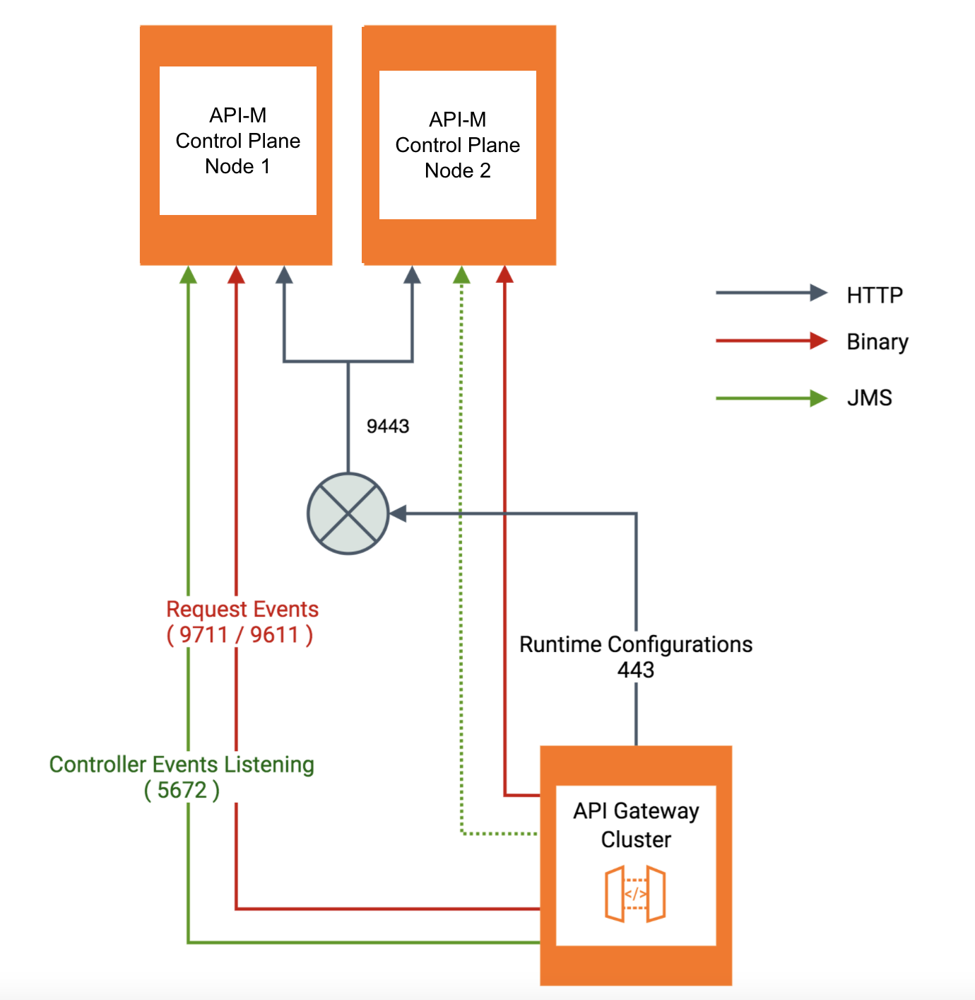
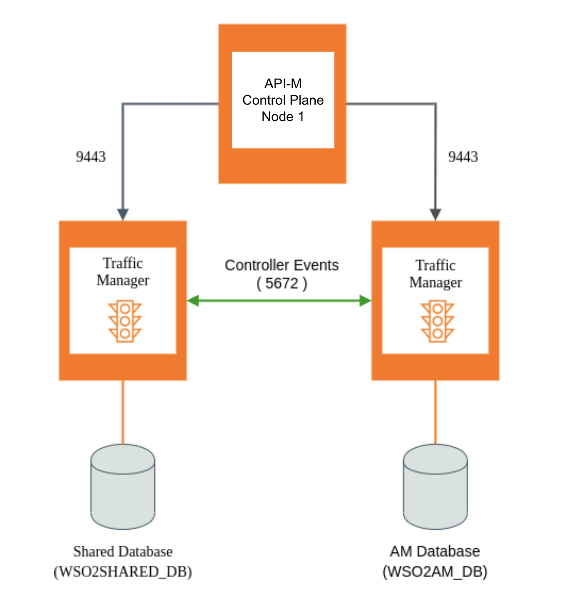

# Customize WSO2 Puppet resources to deploy API Manager Pattern 3

This document provides instructions to customize the WSO2 API Manager Puppet resources in order to deploy API Manager Pattern 3 which is an extension of Pattern 2.

## Copy the pack and JDK

Copy the JDK and the product pack as mentioned in the [Quick start guide](../README.md).

> NOTE: Make sure you include any third-party dependencies required to the downloaded product pack.

## Customize the WSO2 Puppet scripts

The followings are the modules needed to deploy API Manager pattern 3.

- apim_gateway
- apim_control_plane
- apim_tm

API Manager pattern 3 contains 3 profiles and the configurations specific for each profile should be in the respective params.pp files in the `<puppet_environment>/modules/<profile>/manifests` folder.

> NOTE: Moreover, the common configurations for all the profiles are included in the `params.pp` file in the `<puppet_environment>/modules/apim_comon/manifests` directory.

### 1. Customize `apim_gateway` module

Navigate to [carbon-home](../modules/apim_gateway/templates/carbon-home) of the `apim_gateway` module. Follow the instructions in the [document](https://apim.docs.wso2.com/en/latest/install-and-setup/setup/distributed-deployment/deploying-wso2-api-m-in-a-distributed-setup/#configure-the-gateway-nodes) and modify the files.

### 2. Customize `apim_control_plane` module

Navigate to [carbon-home](../modules/apim_control_plane/templates/carbon-home) of the `apim_control_plane` module. Follow the instructions in the [document](https://apim.docs.wso2.com/en/latest/install-and-setup/setup/distributed-deployment/deploying-wso2-api-m-in-a-distributed-setup/#configure-the-control-plane-nodes) and modify the files.

### 3. Customize `apim_tm` module

Navigate to [carbon-home](../modules/apim_tm/templates/carbon-home) of the `apim_tm` module. Follow the instructions in the [document](https://apim.docs.wso2.com/en/latest/install-and-setup/setup/distributed-deployment/deploying-wso2-api-m-in-a-distributed-setup/#configure-separate-traffic-manager-nodes-optional) and modify the files.
